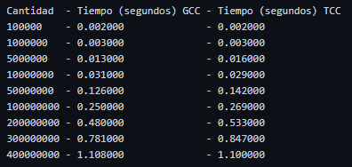
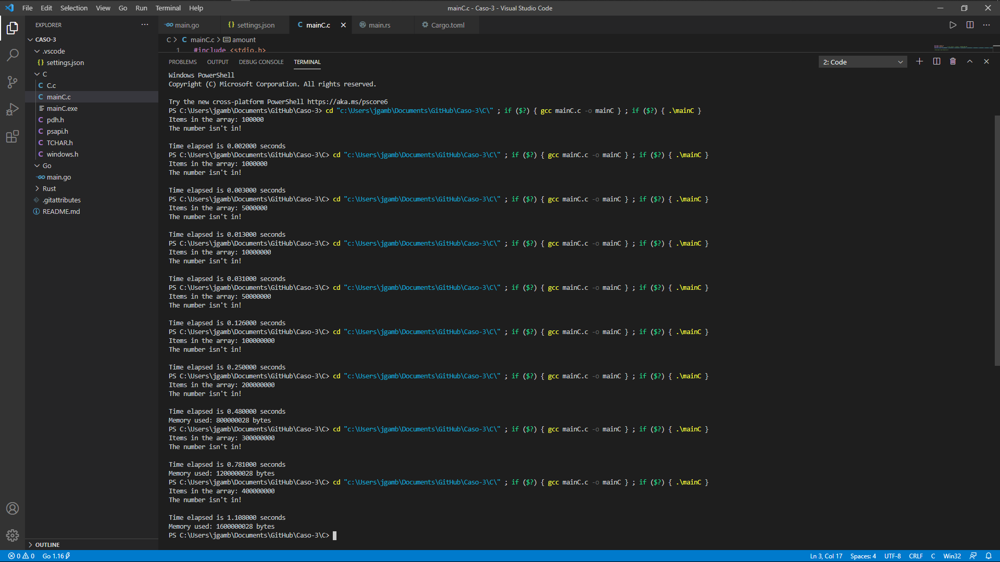
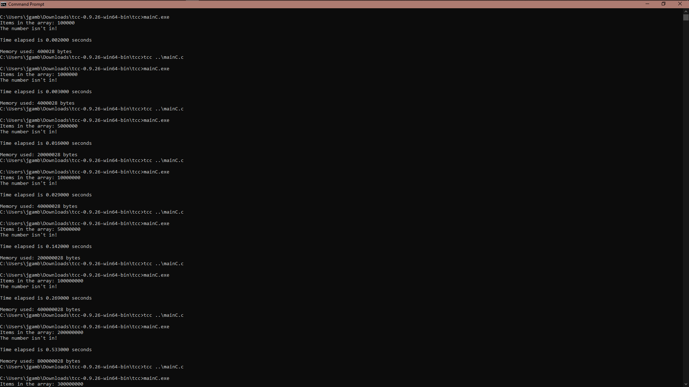
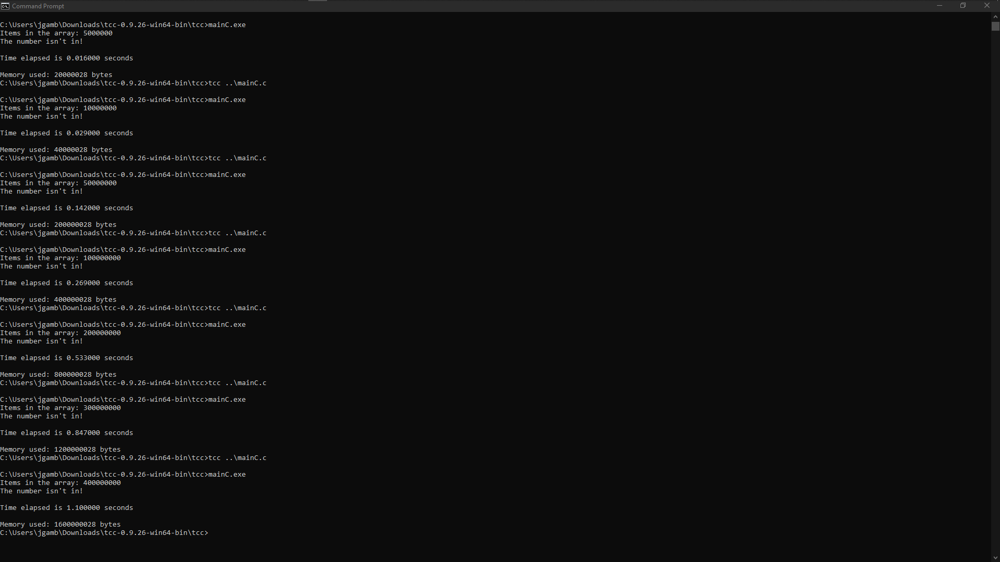

# Caso-3
 Caso 3 Analisis de algoritmos 
 
 Specs de la computadora usada:
 
 

 
 Pasos pruebas C:
  1. Para compilar el codigo con el compilador especial de C, fue descargado "Tiny C Compiler" (tcc), mientras que el compiladore de C++ fue "GNU Compiler Collection" (gcc)
  2. El codigo consiste en una busqueda lineal en donde el numero buscado no es parte de esta, por lo que es el peor de los casos y conseguimos el tiempo y la memoria utilizada, para probar que tanto cambiaba el tiempo, se fue gradualmente aumentando el tamaño del arreglo utilizado. Los tamaños fueron (de mayor a menor): 400000000, 300000000, 200000000, 100000000, 50000000, 10000000, 5000000, 1000000, 100000.
  3. Con tcc, desde cmd se compilo el archivo con el comando tcc ..\mainC.c, mientras que con el otro desde la terminal de VSCode con el comando cd "c:\Users\jgamb\Documents\GitHub\Caso-3\C\" ; if ($?) { gcc mainC.c -o mainC } ; if ($?) { .\mainC }
  4. Se revisaron los tiempos y la memoria, y se tomaron capturas de pantalla de los resultados.
  
  
 Tabla C:
 

R/ Como se puede observar, ambos compiladores estan bastante cerca con los tiempos, pero con nustros resultados, el compilador de C++ (gcc) ganó obteniendo un menor tiempo.

 Screenshots:
 GCC
 
 
 TCC. Parte 1
 
 
 Parte 2
 
 
 a
